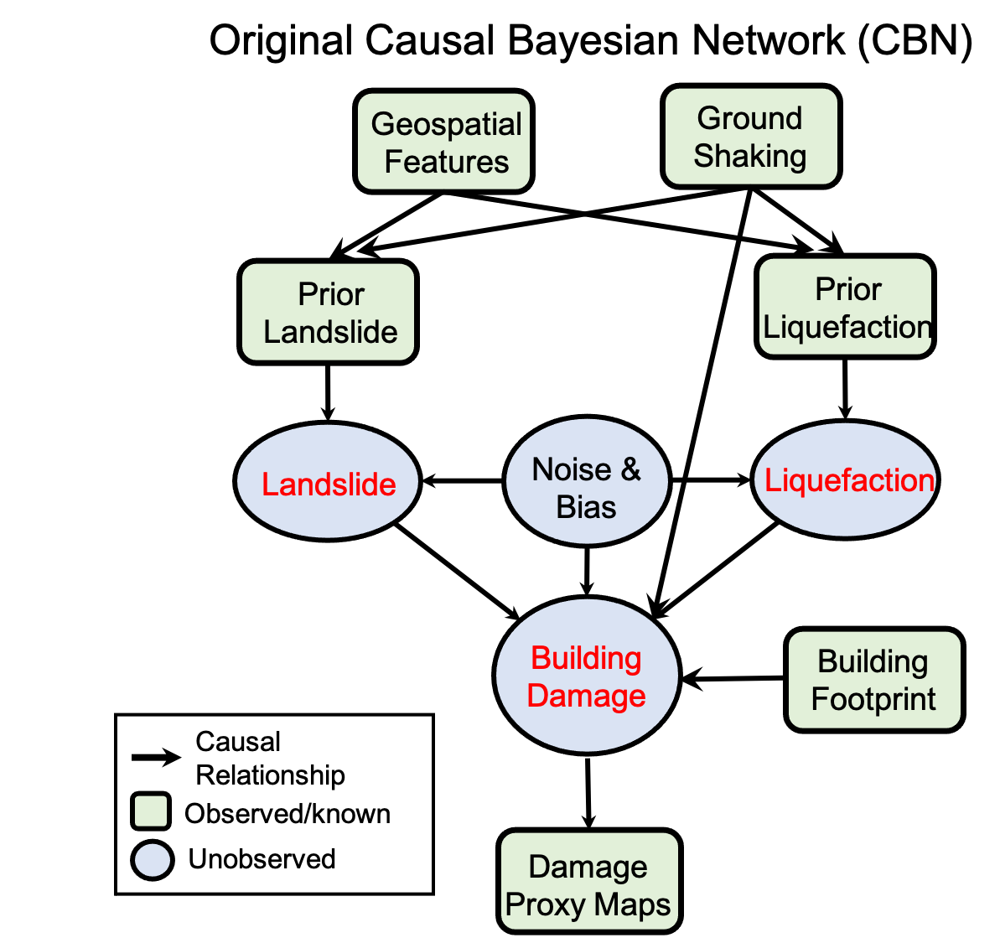

# Variational Causal Bayesian Inference for Seismic Multi-hazard Estimation from Satellite Images
This is the code for "Seismic Multi-hazard Estimation via Causal Inference from Satellite Imagery".

## Install
This code depends on Matlab and QGIS.

## Get started
To get started, cd into the directory. Download and store the DPM(DPM.tif), building footprint(BD.tif), prior landslide(PLS.tif), and prior liquefaction(PLF.tif) to local directory. Please make sure that they have consistent size and dimension. In most cases, prior models have much lower resolutions than DPM, so it is necessary to discretize the prior estimations to make the map size the same as the DPMs (though the resolution stays low).

The main codes locate under the directory of method.
updating.m is the main function to optimize the causal Bayesian inference. In the updating.m, "location" refers to the directory storing DPM, building footprint(BD.tif), prior landslide(PLS.tif), and prior liquefaction(PLF.tif). In updating.m: 
* prune_type represents the type of pruning the original causal graph to accelerate the computing. "double" refers to symmetric pruning where given a location, prune one node from LS and LF if the absolute difference between prior LS and LF is larger than a given threshold specified by sigma (which is often set as 0 or median of the difference). "single" refers to an asymmetric pruning where given a location, prune LF node if LS is larger than LF+sigma and prune LS if LF is larger than LS, or the opposite case. 
* sigma refers to pruning threshold to retain only one node from LS and LF in the locations where prior models are very sure that only one of the hazards exist. If you are confident with the prior model, you can set sigma as 0, otherwise we will recommend to try median or mean of the absolute differences. 
* lambda and regu_type refer to the regularization term. regu_type == 1 refers to that the model will rely more on DPM, regu_type == 2 refers to that the model will rely more on the prior model. lambda control the levels of regularization, higher means more strongly restricting the impacts of DPM (regu_type==2) or prior model(regu_type==1). We recommend to setup lambda as 0 if you do not have any prior understanding about the confidence level of DPM and prior models.
* rho is the learning rate for optimization, delta is the aceptable tolerance level for convergence. eps_0 is a small number to get rid of negative entropy. 
* Nq is the number of posterior probability iterations at each location in each epoch. We often set it as 10.

SVI.m is the stochastic variational inference process which optimizes the posterior and weights. 

performance.m refers to the evaluation metric, including true positive rate, false positive rate, ROC, DET, PR, and AUC calculation. 

## Results
The results are automatically saved in the location specified by 'filename' in updating.m. final_QLS, final_QLF are the landslide, liquefaction estimation by our model, respectively. opt_QBD is the building damage (BD) estiamtion by our model. local is the finally updated pruning strategy, local = 1,3 represent only LS or LS+BD, local = 2,4 refer to only LF or LF+BD, local = 5 refers to LS+LF, local=6 refers to LS+LF+BD. If you are very sure about the mutual exclusive between LS and LF at some locations, you can incorporate that in the original pruning strategies (prune.m).

The system is built based on the causal graph depicting the physical interdependencies among different seismic hazards, impacts, and Damage Proxy Maps (DPMs).

    

### the 2018 Hokkaido Earthquake

    

We test the performance of our system on multiple earthquake events, including the 2018 Hokkaido earthquake, 2016 Central Italy earthquake, the 2019 Ridgecrest earthquake, and the 2020 Puerto Rico earthquake. We here show a comparison between our prediction results and existing USGS landslide model for landslide in Hokkaido. 

## Contact
Please contact susu.xu@stonybrook.edu if you have any question on the codes.

## Disclamer
This project is supported by USGS, Stanford Unviersity, and Stony Brook University. 
